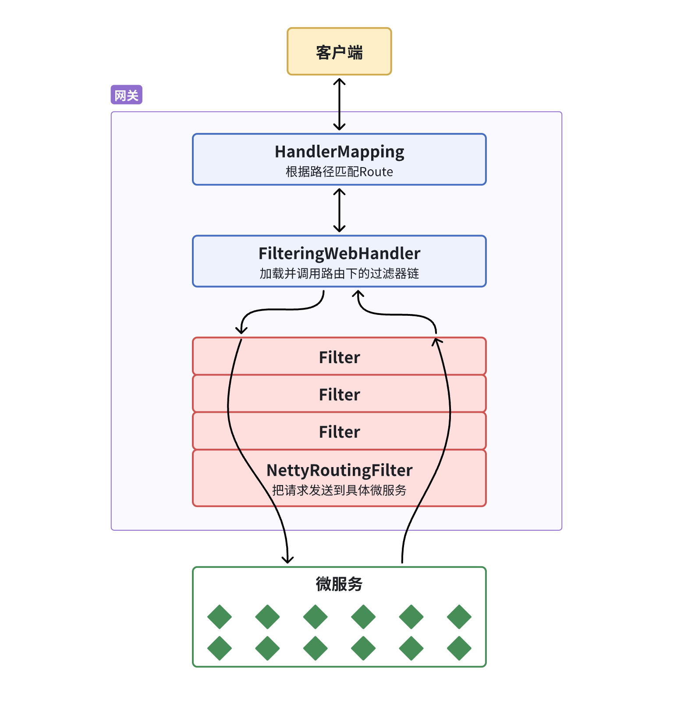

## Gateway-网关

### 用网关做权限管理

- 当单体项目被拆分成不同模块后，访问不同的模块需要用网关来做统一的全局过滤校验。

- 因为使用微服务架构以后，每个模块都有自己的独立请求地址，与只有一个请求路径的单体项目不一样。在单体项目中接收到的请求都会经过Spring MVC的过滤器，因此可以在这里做统一的用户权限验证。
- 在微服务架构下，每个模块都可以有自己的Spring MVC过滤器，如果在每个模块都编写代码去进行权限验证，以后维护起来会非常麻烦。
- 在这种情况之下，Spring提供的Gateway去进行权限验证是很好的解决方案。因为所有的请求都会先经过Gateway再转发到其它微服务。


使用网关做登陆拦截验证不需要用到Spring MVC的拦截器，因为它本身就是一个过滤器。只需要将请求转发到微服务之前利用自带的FilteringWebHandler去做验证处理。



- 为了避免在每个微服务中单独写重复的拦截器代码，可以在通用的模块common中编写。因为每个微服务都会引用common的依赖。


## Seata配置

We can create a shared configuration in Nacos.

```yaml
seata:
  registry: # TC服务注册中心的配置，微服务根据这些信息去注册中心获取tc服务地址
    type: nacos # 注册中心类型 nacos
    nacos:
      server-addr: 10.211.55.8:8848 # nacos地址
      namespace: "" # namespace，默认为空
      group: DEFAULT_GROUP # 分组，默认是DEFAULT_GROUP
      application: seata-server # seata服务名称
      username: nacos
      password: nacos
  tx-service-group: hmall # 事务组名称, Can be think of as cluster group
  service:
    vgroup-mapping: # 事务组与tc集群的映射关系
      hmall: "default"
```


**事务组**

- 微服务与TC服务建立连接时，我们希望它们能够在同一个机房或者同一个集群，这样能够拥有更快的连接速度。因此在配置的时候，需要配置 tx-service-group 这项属性。

- 此外，还需要配置事务组映射的key，上面的配置 hmall: "defaule" 意思是hmall组对应的集群是"default"集群。


## 分布式事务处理(DTP, Distributed Transaction Processing)

### XA模式


在XA规范中，每个分支事务执行完不会立即提交，要等到最后一个分支事务执行完以后才会提交。

整个流程分为两个阶段执行：

- 一阶段
  - RM注册分支事务到TC
  - RM执行分支业务SQL但不提交
  - RM报告执行状态到TC
- 二阶段
  - TC检测各分支事务的执行状态
    - 成功，通知所有RM**提交**事务
    - 失败，通知所有RM**回滚**事务
  - RM收到TC指令，提交或回滚事务


XA事务强一致，满足ACID。

但是XA需要锁定数据库资源，需要等待第二阶段完成之后才会释放，性能差。


### AT模式


AT模式与XA模式最大的区别就是在调用完分支之后会马上提交，不需要等待第二阶段完成以后再提交事务，减少等待时间。

XA模式强一致；AT模式最终一致


阶段一RM的工作：

- 注册分支事务
- 记录undo-log
- 执行业务sql并提交
- 报告事务状态

阶段二提交时RM的工作：

- 删除undo-log

阶段二回滚时RM的工装：

- 根据undo-log恢复数据到更新前